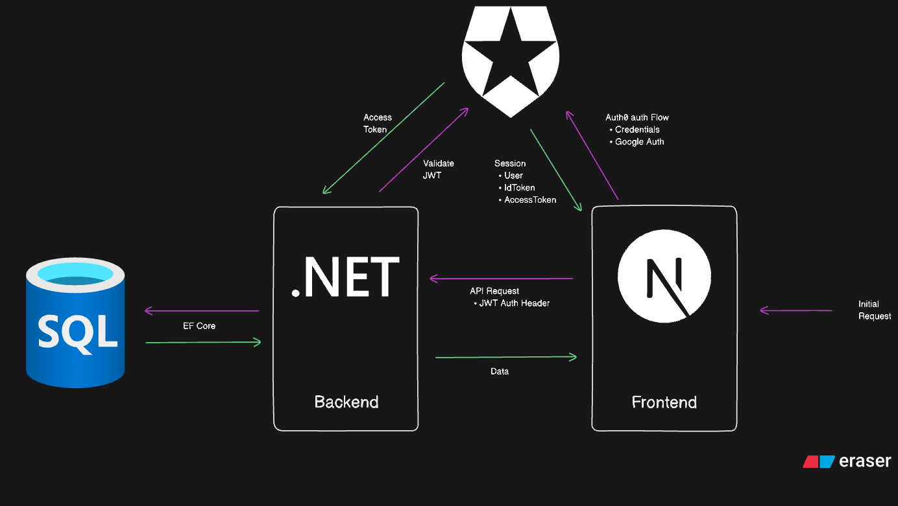
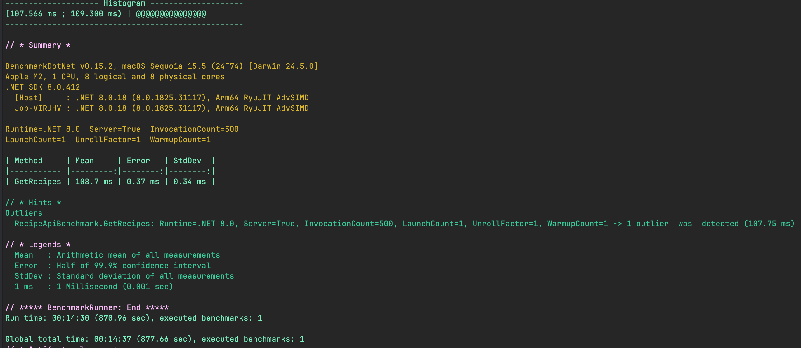

# ByteBites

Your one stop shop for bites

API URL: https://bytebites.azurewebsites.net/
Frontend URL: https://bytebites.johannesmogashoa.co.za

## Get Started

### Prerequisites

To successfully setup the project and run it locally the following are required:

-   Node JS LTS
-   .NET SDK 8.0.0
-   Docker
-   Visual Studio and/or Visual Studio Code
-   Auth0 account with 2 setups
    -   Web Application with NEXTJS
    -   API with the NEXTJS granted permission

### Setup

#### Frontend

-   Setup NodeJS and have NPM successfully installed
-   Open the terminal & navigate to `src/Frontend` and execute `npm install`
-   Create a `.env` or `.env.local` file and copy the contents of the `.env.example` file and place the correct values

#### Backend

-   Ensure to have the .NET SDK installed with EF Core tools installed globally
-   Docker compose up the project which will start the sql server db & api

### Architecture

